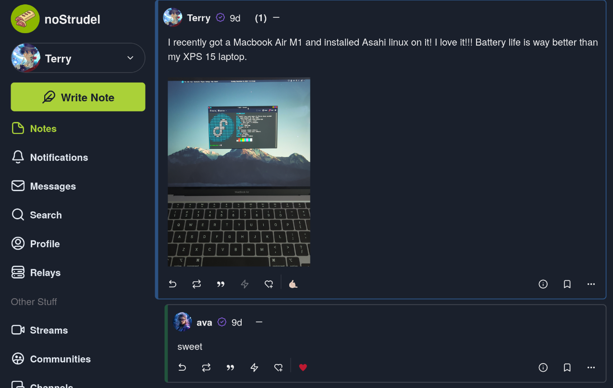

# Uploadstr


[](https://github.com/terryyrret/uploadstr/issues)

[](https://opensource.org/license/agpl-v3/)

A static file server that allows for uploading files, deleting files, viewing a list of uploaded files, or statically serving files from a URL. Uploading, deleting, and viewing a list of files uses Nostr HTTP Auth (NIP-98) to authenticate the user. This service is meant for self-hosting and not intended for large scale use.

## Motivation
Why depend on a service like nostr.build when you can upload images and videos to your own service? A centralized service like nostr.build can take down your images and videos which results in viewers of your affected notes seeing 404 Errors and missing potentially important context. Running a service like uploadstr reduces that liability because you are not dependent on a service entirely managed by someone else.

Take a look at this post I made on nostr with an image I uploaded to my own instance of uploadstr.



All I needed to do to use that image from my uploadstr service was to just include the URL in the note it gave me when I uploaded the image to it: <https://img.yrret.me/f/KLrdWqwunV_By9unAKnKwISfCB7A4O5JIr91ynOoNJY.jpg>

## Features
- RESTful API Endpoints
  - /list - get a list of files stored on the server (requires Nostr auth)
  - /delete - delete a file stored on the server (requires Nostr auth)
  - /upload - upload a file to the server (requires Nostr auth)
  - /f - statically serve files stored on the server (freely served to anyone without any auth)
  - Check wiki for documentation on these endpoints.
- Docker container to easily spin up and run service
- Configurable pubkey whitelist to configure who can use the /list, /delete, /upload endpoints.

## Notes
I have another project on github called [uploadstr-webui](https://github.com/terryyrret/uploadstr-webui) which you can also self-host and connect it to a running instance of uploadstr. It allows you to use a NIP-07 extension like nos-2x to authenticate to upload, delete, or view a list of files from your uploadstr instance.

## Config file
Uploadstr looks for a JSON config file stored at /etc/uploadstr/config. It does not generate one by default so you'll have to create one and put it there. Here is a sample config file.

config
``` json
{
    "bind": "0.0.0.0:3000",
    "baseUrl": "https://img.yrret.me",
    "filesDir": "/var/uploadstr/files",
    "pubkeyWhitelist": [
        "5e46320e8cb01f15a15674106289f9c9bf2ac0470f06bef0efb165959ea084de"
    ]
}
```

Here, we can see this JSON file has only 4 keys. Below is a description of each key.

| Key | Description |
|-----|---------------|
| bind | Address for the service to listen for requests on |
| baseUrl | The base URL that the service is publicly exposed on. This string is used to verify Nostr HTTP Auths | 
| filesDir | The directory for the service to look for and store its files |
| pubkeyWhitelist | An array of pubkeys encoded as hex strings that serves as a whitelist for who can access the auth protected endpoints |

## How to setup the docker container
This repository has a docker workflow that automatically builds docker images containing the uploadstr binary. It is provided for convenience for those that want to use container images. You could instead use the provided binaries or compile them yourself. But, here is a sample docker compose file:

docker-compose.yml
``` yaml
version: "3"
services:
  uploadstr:
    container_name: uploadstr
    image: ghcr.io/terryyrret/uploadstr:latest
    volumes:
      - /Some/Dir/to/files:/var/uploadstr/files
      - /Some/Dir/to/config:/etc/uploadstr/config
```
